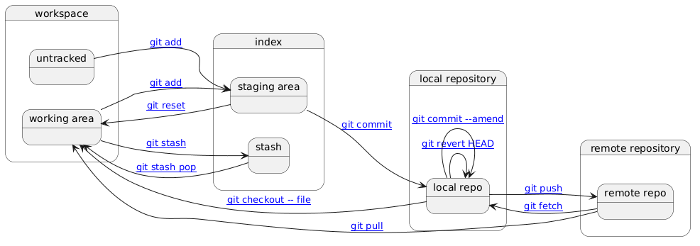
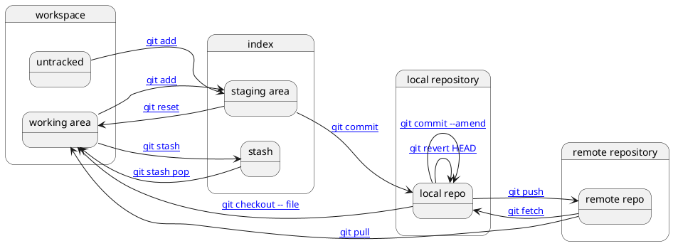

# GIT cheatsheet

## TOC

- [References](#references)
- [State diagram](#state-diagram)
- [Terminology](#terminology)
- [Operations](#operations)
  - [introduction](#introduction)
  - [stage](#stage)
  - [un-stage](#un-stage)
  - [checkout](#checkout)
  - [switch](#switch)
  - [checkout a file](#checkout-a-file)
  - [commit](#commit)
  - [change previous commit](#change-previous-commit)
  - [branch](#branch)
    - [create branch (second method)](#create-branch-second-method)
    - [create branch (checkout branch and if does not exist create it)](#create-branch-checkout-branch-and-if-does-not-exist-create-it)
    - [create branch from previous commit](#create-branch-from-previous-commit)
  - [compare](#compare)
    - [compare (working area vs staging area)](#compare-what-is-in-the-working-area-with-what-is-in-the-staging-area)
    - [compare (staging area vs local repo)](#compare-what-is-in-the-staging-area-with-what-is-in-the-local-repo-ie-committed)
    - [compare (working area vs local repo)](#compare-what-is-in-the-working-area-with-what-is-in-the-local-repo-ie-committed)
    - [compare flags](#compare-flags)
  - [revert (undo commit)](#revert-undo-commit)
  - [move file](#move-file)
    - [move file first method](#move-file-first-method)
    - [move file second method](#move-file-second-method)
    - [move file third method](#move-file-third-method)
  - [reset (move HEAD to a previous commit)](#reset-move-head-to-a-previous-commit)
  - [reset (ignore changes, get latest committed)](#reset-ignore-all-working-and-staged-changes-and-get-the-latest-commited-files)
  - [rebase](#rebase)
  - [interactive rebase](#interactive-rebase)
  - [recover deleted files](#recover-deleted-files)
- [Tag operations](#tag-operations)
  - [create tag](#create-tag)
  - [remove tag](#remove-tag)
  - [checkout by tag](#checkout-by-tag)
  - [view tags](#view-tags)
- [Stash operations](#stash-operations)
  - [stash](#stash)
  - [stash pop](#stash-pop)
- [Branch operations](#branch-operations)
  - [switch to branch](#switch-to-branch)
  - [view current branches](#view-current-branches)
  - [delete branch](#delete-branch)
  - [merge branches (merge branch with master)](#merge-branches-merge-branch-with-master)
  - [merge branches - resolve conflicts](#merge-branches---resolve-conflicts)
    - [rebase (do not use)](#rebase-1)
    - [merge branch into master](#merge-branch-into-master)
- [Repository operations](#repository-operations)
  - [multiple repositories](#multiple-repositories)
  - [clone](#clone)
  - [add remote](#add-remote)
  - [list remote repository](#list-remote-repository)
  - [fetch](#fetch)
  - [pull](#pull)
  - [push](#push)
- [Git command setup](#git-command-setup)
  - [client setup](#client-setup)
  - [update .gitconfig](#update-gitconfig)
  - [update shortcuts](#update-shortcuts)
- [Initialise](#initialise)
  - [create a project/repo (local)](#create-a-projectrepo-local)
  - [get status of project/repo](#get-status-of-projectrepo)
  - [get history of project/repo](#get-history-of-projectrepo)
  - [get history with files updated](#get-history-with-files-updated)
- [Git worktree](#git-worktree)
  - [add worktree](#add-worktree)
  - [add worktree for existing branch](#add-worktree-for-existing-branch)
  - [list worktrees](#list-worktrees)
  - [remove worktree](#remove-worktree)
  - [prune stale worktrees](#prune-stale-worktrees)
- [HOWTO](#howto)
  - [clear all local changes](#clear-all-local-changes)
  - [find the history of a specific file](#find-the-history-of-a-specific-file)
  - [squash](#squash)
  - [display last commit](#display-last-commit)
- [Troubleshoot](#troubleshoot)
- [Git internals](#git-internals)
  - [folder structure](#folder-structure)
  - [Object types](#object-types)
    - [get sha of head](#get-sha-of-head)
    - [get pretty contents of object by sha](#get-pretty-contents-of-object-by-sha)
    - [show the tree object of a commit object](#show-the-tree-object-of-a-commit-object-includes-blob-objects-and-tree-objects)
- [Git branching workflows](#git-branching-workflows)

## References

* [Pro Git book](https://git-scm.com/book/en/v2/)
* [branching and merging](https://www.youtube.com/watch?v=FyAAIHHClqI)
* [git - the simple guide](https://rogerdudler.github.io/git-guide/)
* [Git commands that you must know](https://medium.com/javarevisited/git-commands-that-you-must-know-7ff17fab7482)
* [Git interview questions for DevOps](https://medium.com/@tech.manojk10/git-interview-questions-and-answers-for-devops-5d0b971f8fbb)
* [Use git like a senior engineer](https://levelup.gitconnected.com/use-git-like-a-senior-engineer-ef6d741c898e)

## State diagram

This is an elementary level diagram depicting the various places a file (Object) is registered. 
It is for presentation purposes only, it is not complete, it is not very accurate but it is sufficient
for introduction to git.



Source: 

<!-- 
LR --\> LR : [[#branch git branch]]
LR --\> LR : [[#tag git tag]]

WA --\> WA : [[#checkout git checkout]]
SA --\> SA : [[#checkout git checkout]]

WA --\> WA : [[#revert git revert]]
SA --\> SA : [[#revert git revert]]
LR --\> LR : [[#revert git revert]]

WA --\> WA : [[#mv git mv]]
SA --\> SA : [[#mv git mv]]
WA --\> WA : [[#rm git rm]]
SA --\> SA : [[#rm git rm]]

LR --\> LR : [[#reset-soft git reset --soft]]
-->

## Terminology

- workspace (aka project folder, working area, working directory)
  - untracked file: new file that git has not been told to track previously
  - working area files (aka working directory files): files that have been modified but not committed

- staging area (aka index): files modified/added that are marked to go into the next commit

- local repo: local repository or local copy of a remote repository

- remote repo (aka upstream repo): hosted repository on a shared server

- Stash: save my work temporarily so I can come back later

- Git is basically: a content-addressed database (.git/objects) + pointers (refs + HEAD) + a staging buffer (index).

- ref: reference, a name that points to a commit hash, Instead of remembering a long hash like: a35f9b2c4d8a12e9c5a... a ref is simply a name main like: HEAD, v1.0, origin/main, that points to a commit hash. 

- HEAD: a pointer to the current commit — normally the tip of the currently checked-out branch. When you make a new commit, HEAD moves forward to point to it. In a "detached HEAD" state, HEAD points directly to a commit rather than a branch.

Herein we avoid the terms:
- working directory files, to refer to committed files, since in a directory there might be untracked files.
- working directory, the "directory" in git is much different than traditional directories/folders.


## Operations

### Introduction

Operations change files in the following areas (WA: Working Area, SA: Staging Area, LR: Local Repository):

| Command                         | WA | SA | LR | Notes                                                                                      |
| ----------------------------    | -- | -- | -- | ------------------------------------------------------------------------------------------ | 
| `git add <file>`                | ❌ | ✅ | ❌ | Stage changes for next commit                                                              | 
| `git commit`                    | ❌ | ❌ | ✅ | Saves staged index as new commit in repository                                             | 
| `git branch`                    | ❌ | ❌ | ✅ | Creates a branch pointer only in `.git/refs/heads/`                                        | 
| `git tag`                       | ❌ | ❌ | ✅ | Creates a tag pointer in `.git/refs/tags/`; does not change files                          | 
| `git switch <branch>`           | ✅ | ✅ | ❌ | Moves HEAD to branch and updates working directory/index to match branch                   |
| `git checkout <branch\|commit>` | ✅ | ✅ | ❌ | Switch branch or checkout commit; updates HEAD + index + working directory                 |
| `git checkout -b <branch>`      | ✅ | ✅ | ✅ | Creates a new branch pointer and switches to it; updates HEAD + working directory + index  |
| `git revert <commit>`           | ✅ | ✅ | ✅ | Creates a new commit that undoes a previous commit; updates index + working directory      | 
| `git mv <old> <new>`            | ✅ | ✅ | ❌ | Rename or move a file; staged for next commit                                              |
| `git rm <file>`                 | ✅ | ✅ | ❌ | Remove file from working directory + index; commit needed to remove from repo              |
| `git reset --soft <commit>`     | ❌ | ❌ | ✅ | Move branch pointer only; index + working dir untouched                                    |
| `git reset --mixed <commit>`    | ❌ | ✅ | ✅ | Move branch pointer + reset index; working dir unchanged                                   |
| `git reset --hard <commit>`     | ✅ | ✅ | ✅ | Move branch pointer + reset index + working directory; discards changes                    |
| `git stash`                     | ✅ | ✅ | ❌ | Save working directory + staged changes into stash; working dir cleaned                    |
| `git stash apply`               | ✅ | ✅ | ❌ | Apply stashed changes to working directory and index; stash remains                        |
| `git stash pop`                 | ✅ | ✅ | ❌ | Apply stashed changes and remove them from stash                                           |
| `git fetch`                     | ❌ | ❌ | ✅ | Update remote tracking branches in local repo; does not change working directory           |
| `git pull`                      | ✅ | ✅ | ✅ | Fetch + merge (or rebase) from remote; may update files, index, and repo                   |
| `git merge <branch>`            | ✅ | ✅ | ✅ | Merge another branch into current; creates commit if needed, may update files/index        |
| `git rebase <branch>`           | ✅ | ✅ | ✅ | Reapply commits on top of another branch; rewrites history, updates working dir/index/repo |

### stage 

Stage: know about a change, but do not register as permanent in the repository.

```bash
git add file.txt
git add . # add all files and folders (recursively)
```

| Command                        | WA | SA | LR | Notes                                                                                      |
| ----------------------------   | -- | -- | -- | ------------------------------------------------------------------------------------------ | 
| `git add <file>`               | ❌ | ✅ | ❌ | Stage changes for next commit                                                              | 

### un-stage

Removes files from the staging area (index) back to the working area. The modifications on the file remain in the working area but are no longer marked for the next commit.

```bash
git reset                  # unstage all staged files
git reset HEAD hello.html  # unstage a specific file

# modern alternative (git 2.23+)
git restore --staged hello.html  # unstage a specific file
git restore --staged .           # unstage all staged files
```

| Command                        | WA | SA | LR | Notes                                                                                      |
| ----------------------------   | -- | -- | -- | ------------------------------------------------------------------------------------------ | 
| `git reset --mixed <commit>`   | ❌ | ✅ | ✅ | Move branch pointer + reset index; working dir unchanged                                   |

ref: [undoing staged changes](https://githowto.com/undoing_staged_changes)

### checkout

```bash
git checkout feature/x
```

| Command                        | WA | SA | LR | Notes                                                                                      |
| ----------------------------   | -- | -- | -- | ------------------------------------------------------------------------------------------ | 
| `git checkout <branch|commit>` | ✅ | ✅ | ❌ | Switch branch or checkout commit; updates HEAD + index + working directory                 |

### switch

```bash
git switch feature/x
```

| Command                        | WA | SA | LR | Notes                                                                                      |
| ----------------------------   | -- | -- | -- | ------------------------------------------------------------------------------------------ | 
| `git switch <branch>`          | ✅ | ✅ | ❌ | Moves HEAD to branch and updates working directory/index to match branch                   |

### checkout a file

checkout a file: undo changes in working directory

```bash
git checkout -- file.txt
```

| Command                        | WA | SA | LR | Notes                                                                                      |
| ----------------------------   | -- | -- | -- | ------------------------------------------------------------------------------------------ | 
| `git checkout -- <file>`       | ✅ | ❌ | ❌ | Restore file in working directory from index; discards uncommitted changes                 |

### commit

```bash
git commit -m "an update" # commit staged changes
git commit -a # stage and commit
```

| Command                        | WA | SA | LR | Notes                                                                                      |
| ----------------------------   | -- | -- | -- | ------------------------------------------------------------------------------------------ | 
| `git commit`                   | ❌ | ❌ | ✅ | Saves staged index as new commit in repository                                             | 

### change previous commit

```bash
git commit --amend -m "Add an author/email comment"
```

| Command                        | WA | SA | LR | Notes                                                                                      |
| ----------------------------   | -- | -- | -- | ------------------------------------------------------------------------------------------ | 
| `git commit --amend`           | ❌ | ❌ | ✅ | Replaces the most recent commit with a new one; rewrites history                           | 

ref: [amending commits](https://githowto.com/amending_commits)

### branch

Creates a new pointer. No files change, no staging changes occur.

```bash
git branch feature/x
```

| Command                        | WA | SA | LR | Notes                                                                                      |
| ----------------------------   | -- | -- | -- | ------------------------------------------------------------------------------------------ | 
| `git branch`                   | ❌ | ❌ | ✅ | Creates a branch pointer only in `.git/refs/heads/`                                        | 

### create branch (second method)

```bash
git branch branch_name
git checkout branch_name
```

| Command                         | WA | SA | LR | Notes                                                                                      |
| ----------------------------    | -- | -- | -- | ------------------------------------------------------------------------------------------ | 
| `git branch`                    | ❌ | ❌ | ✅ | Creates a branch pointer only in `.git/refs/heads/`                                        | 
| `git checkout <branch\|commit>` | ✅ | ✅ | ❌ | Switch branch or checkout commit; updates HEAD + index + working directory                 |

### create branch (checkout branch and if does not exist create it)

```bash
git checkout -b style
```

| Command                        | WA | SA | LR | Notes                                                                                      |
| ----------------------------   | -- | -- | -- | ------------------------------------------------------------------------------------------ | 
| `git checkout -b <branch>`     | ✅ | ✅ | ✅ | Creates a new branch pointer and switches to it; updates HEAD + working directory + index  |

ref: [creating a branch](https://githowto.com/creating_a_branch)

### create branch from previous commit

```bash
git branch branch_name SHA_OF_COMMIT
# or
git branch branch_name HEAD~3
# or (create and checkout)
git checkout -b branch_name SHA_OF_COMMIT
```

| Command                        | WA | SA | LR | Notes                                                                                      |
| ----------------------------   | -- | -- | -- | ------------------------------------------------------------------------------------------ | 
| `git branch`                   | ❌ | ❌ | ✅ | Creates a branch pointer only in `.git/refs/heads/`                                        | 
| `git checkout -b <branch>`     | ✅ | ✅ | ✅ | Creates a new branch pointer and switches to it; updates HEAD + working directory + index  |


### compare

Shows differences between versions of files. The output uses `+` for added lines and `-` for removed lines. See sub-sections below for specific comparisons.

```bash
git diff HEAD          # compare the working directory with the latest commit
git diff HEAD 9a9a9a9  # compare latest commit with a specific commit by id
```

#### compare what is in the working area with what is in the staging area

```bash
git diff
```

#### compare what is in the staging area with what is in the local repo (i.e. committed)

```bash
git diff --staged
```

#### compare what is in the working area with what is in the local repo (i.e. committed)

```bash
git diff HEAD
```

#### compare flags

```bash
GD="--color-words " # will only color the changed words
GD="--word-diff " # will only label changed words
GD="--stat " # will only show the changed files
```

### revert (undo commit)

ref: [undoing committed changes](https://githowto.com/undoing_committed_changes)

Purpose: Undo a commit by creating a new commit that reverses the changes.

```bash
git revert HEAD
```

| Command                        | WA | SA | LR | Notes                                                                                      |
| ----------------------------   | -- | -- | -- | ------------------------------------------------------------------------------------------ | 
| `git revert <commit>`          | ✅ | ✅ | ✅ | Creates a new commit that undoes a previous commit; updates index + working directory      | 

### move file

#### move file first method
ref: [moving files](https://githowto.com/moving_files)

```bash
git mv file.txt lib-folder
```

| Command                        | WA | SA | LR | Notes                                                                                      |
| ----------------------------   | -- | -- | -- | ------------------------------------------------------------------------------------------ | 
| `git mv <old> <new>`           | ✅ | ✅ | ❌ | Rename or move a file; staged for next commit                                              |

#### move file second method

```bash
mv file.txt lib-folder
git add lib-folder/file.txt
git rm file.txt # here git will identify the moved file
git commit -m "Moved file.txt to lib-folder"
```

| Command                        | WA | SA | LR | Notes                                                                                      |
| ----------------------------   | -- | -- | -- | ------------------------------------------------------------------------------------------ | 
| `git add <file>`               | ❌ | ✅ | ❌ | Stage changes for next commit                                                              | 
| `git rm <file>`                | ✅ | ✅ | ❌ | Remove file from working directory + index; commit needed to remove from repo              |
| `git commit`                   | ❌ | ❌ | ✅ | Saves staged index as new commit in repository                                             | 

#### move file third method

```bash
mv file.txt lib-folder
git add -A . # will find the moved file
git commit -m "Moved file.txt to lib-folder"
```

| Command                        | WA | SA | LR | Notes                                                                                      |
| ----------------------------   | -- | -- | -- | ------------------------------------------------------------------------------------------ | 
| `git add <file>`               | ❌ | ✅ | ❌ | Stage changes for next commit                                                              | 
| `git commit`                   | ❌ | ❌ | ✅ | Saves staged index as new commit in repository                                             | 

### reset (move HEAD to a previous commit)

Moves the HEAD pointer (and the current branch tip) back to a previous commit. The three modes control what happens to the index and working area:

| mode | HEAD | index (staging) | working area |
|------|:----:|:---------------:|:------------:|
| `--soft` | moved | unchanged | unchanged |
| `--mixed` (default) | moved | reset | unchanged |
| `--hard` | moved | reset | reset |

```bash
git reset --soft HEAD~1   # undo last commit, keep changes staged
git reset HEAD~1          # undo last commit, keep changes unstaged (default: --mixed)
git reset --hard HEAD~1   # undo last commit, discard all changes
git reset --hard a1b2c3d  # move HEAD to a specific commit, discard all changes
```

> **Warning:** `--hard` permanently discards all uncommitted changes to **tracked** files — they cannot be recovered. Untracked files (new files not yet added via `git add`) are **not** affected by `--hard`; use `git clean -fd` to also remove those.

| Command                        | WA | SA | LR | Notes                                                                                      |
| ----------------------------   | -- | -- | -- | ------------------------------------------------------------------------------------------ | 
| `git reset --soft <commit>`    | ❌ | ❌ | ✅ | Move branch pointer only; index + working dir untouched                                    |
| `git reset --mixed <commit>`   | ❌ | ✅ | ✅ | Move branch pointer + reset index; working dir unchanged                                   |
| `git reset --hard <commit>`    | ✅ | ✅ | ✅ | Move branch pointer + reset index + working directory; discards changes                    |

ref:
* [resetting the master branch](https://githowto.com/resetting_the_master_branch)
* [resetting the greet branch](https://githowto.com/resetting_the_greet_branch)

### reset (ignore all working and staged changes and get the latest commited files)

Resets both the index (staging area) and the working area to match the latest commit, discarding all local modifications. Unlike `reset --hard HEAD~1`, this does not move HEAD — it stays on the same commit.

```bash
git reset --hard HEAD
```

Use cases:
- Throw away all local edits and return to the last committed state
- Undo accidental changes across multiple files before committing
- Start over after a failed or messy merge attempt

| Command                        | WA | SA | LR | Notes                                                                                      |
| ----------------------------   | -- | -- | -- | ------------------------------------------------------------------------------------------ | 
| `git reset --hard <commit>`    | ✅ | ✅ | ✅ | Move branch pointer + reset index + working directory; discards changes                    |

### rebase

Rebase replays commits from the current branch on top of another branch, producing a linear history. Unlike merge, it rewrites commit history — do not rebase commits already pushed to a shared remote.

```bash
git rebase main          # replay current branch commits on top of main
git rebase --abort       # cancel an in-progress rebase
git rebase --continue    # continue after resolving conflicts
```

Use case: keeping a feature branch up to date with `main` without creating merge commits:

```bash
git checkout feature
git rebase main
```

| Command                         | WA | SA | LR | Notes                                                                                      |
| ----------------------------    | -- | -- | -- | ------------------------------------------------------------------------------------------ | 
| `git checkout <branch\|commit>` | ✅ | ✅ | ❌ | Switch branch or checkout commit; updates HEAD + index + working directory                 |
| `git rebase <branch>`           | ✅ | ✅ | ✅ | Reapply commits on top of another branch; rewrites history, updates working dir/index/repo |

ref:
[rebase ref 1](https://githowto.com/rebasing)
[rebase ref 2](https://stackoverflow.com/questions/7200614/how-to-merge-remote-master-to-local-branch/7200641)

### interactive rebase

Launches an editor to rewrite a series of commits before they are finalised. Each commit can be reordered, edited, squashed, dropped, or have its message changed.

```bash
git rebase -i HEAD~3   # interactively rebase the last 3 commits
git rebase -i main     # interactively rebase all commits since branching from main
```

Available actions in the editor:

| action | short | effect |
|--------|-------|--------|
| `pick` | `p` | keep the commit as-is |
| `reword` | `r` | keep the commit, edit its message |
| `edit` | `e` | pause to amend the commit |
| `squash` | `s` | meld into the previous commit, combine messages |
| `fixup` | `f` | meld into the previous commit, discard this message |
| `drop` | `d` | remove the commit entirely |

| Command                        | WA | SA | LR | Notes                                                                                      |
| ----------------------------   | -- | -- | -- | ------------------------------------------------------------------------------------------ | 
| `git rebase <branch>`          | ✅ | ✅ | ✅ | Reapply commits on top of another branch; rewrites history, updates working dir/index/repo |

> **Warning:** rewrites history — do not use on commits already pushed to a shared branch.

ref: [interactive rebase](https://dev.to/rlxdprogrammer/advanced-git-tutorial-interactive-rebase-369l)

### recover deleted files

Case 1: the file was deleted but not committed
Get a list of all the deleted files in the working tree:

```bash
git ls-files --deleted
```

restore file:

```bash
git checkout -- filename
```

Case 2: deletion has been committed

```bash
git rev-list -n 1 HEAD -- filename
git checkout <commit>^ -- filename
```

In case you are looking for the path of the file to recover, the following command will display a summary of all deleted files.

```bash
git log --diff-filter=D --summary
```

ref: [recover a deleted file](https://www.quora.com/How-can-I-recover-a-file-I-deleted-in-my-local-repo-from-the-remote-repo-in-Git)

## Tag operations

### create tag

```bash
git tag v1
```

| Command                        | WA | SA | LR | Notes                                                                                      |
| ----------------------------   | -- | -- | -- | ------------------------------------------------------------------------------------------ | 
| `git tag`                      | ❌ | ❌ | ✅ | Creates a tag pointer in `.git/refs/tags/`; does not change files                          | 

### remove tag

ref: [remove a tag](https://githowto.com/remove_the_oops_tag)

```bash
git tag -d v1
```

### checkout by tag

```bash
git checkout v1
git checkout master
```

| Command                        | WA | SA | LR | Notes                                                                                      |
| ----------------------------   | -- | -- | -- | ------------------------------------------------------------------------------------------ | 
| `git checkout <branch|commit>` | ✅ | ✅ | ❌ | Switch branch or checkout commit; updates HEAD + index + working directory                 |


### view tags

```bash
git tag
git hist master --all # view tags in logs
```

## Stash operations

### stash

Saves uncommitted changes (both staged and unstaged) onto a stack and reverts the working area to the last commit. Useful for switching context without committing work in progress.

```bash
git stash          # stash all uncommitted changes
git stash push -m "work in progress on feature X"  # stash with a description
git stash list     # view all stashed entries
```

| Command                        | WA | SA | LR | Notes                                                                                      |
| ----------------------------   | -- | -- | -- | ------------------------------------------------------------------------------------------ | 
| `git stash`                    | ✅ | ✅ | ❌ | Save working directory + staged changes into stash; working dir cleaned                    |

### stash pop

Restores the most recently stashed changes back into the working area and removes them from the stash stack. If there are conflicts, they must be resolved manually.

```bash
git stash pop           # apply and remove the latest stash
git stash pop stash@{2} # apply and remove a specific stash entry
git stash apply         # apply without removing from the stack
```

| Command                        | WA | SA | LR | Notes                                                                                      |
| ----------------------------   | -- | -- | -- | ------------------------------------------------------------------------------------------ | 
| `git stash apply`              | ✅ | ✅ | ❌ | Apply stashed changes to working directory and index; stash remains                        |
| `git stash pop`                | ✅ | ✅ | ❌ | Apply stashed changes and remove them from stash                                           |


## Branch operations

### switch to branch

ref: [navigating branches](https://githowto.com/navigating_branches)

```bash
git checkout branch_name
```

| Command                         | WA | SA | LR | Notes                                                                                      |
| ----------------------------    | -- | -- | -- | ------------------------------------------------------------------------------------------ | 
| `git checkout <branch\|commit>` | ✅ | ✅ | ❌ | Switch branch or checkout commit; updates HEAD + index + working directory                 |

### view current branches

```bash
git branch --all
```

### delete branch

```bash
git branch -d branch_name
git branch -D branch_name # if there are changes - force
```

| Command                        | WA | SA | LR | Notes                                                                                      |
| ----------------------------   | -- | -- | -- | ------------------------------------------------------------------------------------------ | 
| `git branch -d <branch>`       | ❌ | ❌ | ✅ | Delete a merged branch pointer from `.git/refs/heads/`                                     | 

### merge branches (merge branch with master)

Through periodic master branch merging with the style branch you can pick up to the master any changes or modifications to maintain compatibility with the style changes in the mainline.

ref: [merging](https://githowto.com/merging)

```bash
git checkout style # go to branch style
git merge master # merge with master
```

| Command                         | WA | SA | LR | Notes                                                                                      |
| ----------------------------    | -- | -- | -- | ------------------------------------------------------------------------------------------ | 
| `git checkout <branch\|commit>` | ✅ | ✅ | ❌ | Switch branch or checkout commit; updates HEAD + index + working directory                 |
| `git merge <branch>`            | ✅ | ✅ | ✅ | Merge another branch into current; creates commit if needed, may update files/index        |

### merge branches - resolve conflicts

ref:
- [resolving conflicts](https://githowto.com/resolving_conflicts)

```bash
git checkout style
git merge master
# conflicting files will have comments >>>>> ===== <<<<<
git add lib/hello.html
git commit -m "Merged master fixed conflict"
```

Following to be used when: "fatal: Not possible to fast-forward, aborting"

ref:
- [fix: fatal: Not possible to fast-forward](https://linuxpip.org/fix-fatal-not-possible-to-fast-forward-aborting-in-git/)

```bash
git status
git add # add any uncommitted changes
git commit -m "commit message" # commit any uncommitted changes
git fetch # fetch the latest changes from the remote branch
git merge origin/master # merge the remote changes of the master branch into your local branch
# conflicts will be presented
# resolve conflicts
git add # add any uncommitted changes, in particular the manually merged
git commit -m "commit message" # commit any uncommitted changes
git push # push the changes to the remote branch
```

#### rebase 

> **Important:** do not use rebase

```bash
git checkout style
git rebase master
git log
```

| Command                        | WA | SA | LR | Notes                                                                                      |
| ----------------------------   | -- | -- | -- | ------------------------------------------------------------------------------------------ | 
| `git rebase <branch>`          | ✅ | ✅ | ✅ | Reapply commits on top of another branch; rewrites history, updates working dir/index/repo |

ref: [rebasing](https://githowto.com/rebasing)

#### merge branch into master

Once work on a feature branch is complete and tested, merge it back into `master` to make the changes part of the mainline.

```bash
git checkout master
git merge style
```

ref: [merging back to master](https://githowto.com/merging_back_to_master)
ref: [Pull and put all remote changes below local changes](https://www.youtube.com/watch?v=8KCQe9Pm1kg)

## Repository operations

### clone

ref: [cloning repositories](https://githowto.com/cloningrepositories)

```bash
git clone hello cloned_hello
```

### add remote

```bash
git remote add shared URL
git remote add shared ../hello.git
```

### multiple repositories

A local repository can be linked to multiple remote repositories simultaneously. Each remote is given a name (default: `origin`) and can be fetched, pushed, and pulled independently. A common pattern is to use a bare repository (no working directory) as a shared hub accessible by multiple developers.

ref: [multiple repositories](https://githowto.com/mutliple_repositories)

### list remote repository

```bash
git remote
git remote -v
git remote show origin
git branch -a
git fetch
git pull # equal to git fetch; git merge origin/master
```

### fetch

```bash
git fetch
```

| Command                        | WA | SA | LR | Notes                                                                                      |
| ----------------------------   | -- | -- | -- | ------------------------------------------------------------------------------------------ | 
| `git fetch`                    | ❌ | ❌ | ✅ | Update remote tracking branches in local repo; does not change working directory           |

### pull

```bash
git pull
```

| Command                        | WA | SA | LR | Notes                                                                                      |
| ----------------------------   | -- | -- | -- | ------------------------------------------------------------------------------------------ | 
| `git pull`                     | ✅ | ✅ | ✅ | Fetch + merge (or rebase) from remote; may update files, index, and repo                   |

### push

```bash
git push
```

Updates the Remote Repository.

## Git command setup

### client setup

ref: [setup](https://githowto.com/setup)

```bash
git config --global user.name "Your Name"
git config --global user.email "your_email@whatever.com"
git config --global core.autocrlf input
git config --global core.safecrlf true
```

### Update .gitconfig 

Use herestring:

```bash
cat > ~/.gitconfig <<EOF
[alias]
  co = checkout
  ci = commit
  st = status
  br = branch
  hist = log --pretty=format:"%h %ad | %s%d [%an]" --graph --date=short
  lp = log --all --decorate --oneline --graph
  type = cat-file -t
  dump = cat-file -p
EOF
```

### Update shortcuts

```bash
cat >>~/.bashrc <<EOF
alias gs='git status '
alias ga='git add '
alias gb='git branch '
alias gc='git commit'
alias gi='git commit'
alias gd='git diff'
alias go='git checkout '
alias gl='git lp '
alias gk='gitk --all&'
alias gx='gitx --all'

alias got='git '
alias get='git '

function gh() {
cat <<GH_EOF
gs  git status
ga  git add
gb  git branch
gc  git commit
gi  git commit
gd  git diff
go  git checkout
gl  git log pretty
GH_EOF
}
EOF
```

## Initialise

### create a project/repo (local)

```bash
mkdir folder; cd folder
git init
```

### get status of project/repo

```bash
git status
```

### get history of project/repo

```bash
git log
git log --pretty=oneline
git log --pretty=format:"%h %ad | %s%d [%an]" --graph --date=short
```

### get history with files updated

```bash
git log --stat # will also show the involved files
```

```bash
git log --patch # will show the diff
git log --graph --all --decorate --oneline # pretty print logs
```

## Git worktree

A worktree lets you check out multiple branches simultaneously in separate directories, all sharing the same `.git` repository. This avoids stashing or committing unfinished work just to switch context.

Use cases:
- Work on a hotfix while keeping your feature branch untouched
- Run tests on one branch while editing another
- Compare two branches side by side in your editor

### add worktree

Creates a new directory with a new branch checked out.

```bash
git worktree add ../my-feature my-feature
# or create a new branch at the same time
git worktree add -b hotfix ../hotfix-work main
```

### add worktree for existing branch

```bash
git worktree add ../path-to-dir existing-branch
```

### list worktrees

```bash
git worktree list
```

### remove worktree

```bash
git worktree remove ../my-feature
# force removal if the worktree has modifications
git worktree remove --force ../my-feature
```

### prune stale worktrees

Cleans up worktree metadata for directories that were deleted manually.

```bash
git worktree prune
```

## HOWTO

### clear all local changes

```bash
git fetch --all
git reset --hard origin/master
git pull
```

### find the history of a specific file

```bash
git log --stat -- filename.ext
git log --stat -M --follow  -- filename.ext # will also show the history of the file with its renames and moves
```

### squash

[ref](https://levelup.gitconnected.com/squash-and-rebase-my-method-for-merging-git-branches-3b43c52675b6)

````bash
# 1. squash all the commits in your branch and leave just one
git checkout my_branch
git checkout -b my_branch_squashed
git rebase -i <last-commit-on-master-before-my-branch>
git push --set-upstream origin my_branch_squashed

# 2. rebase on master
git checkout -b my_branch_squashed_rebased
git rebase -i master
git push --set-upstream origin my_branch_squashed_rebased

# 3. merge with no conflicts
git checkout master
git merge my_branch_squashed_rebased
git push

# We have too many branches... :(
git branch

# 1. Delete branches from local repository.
git branch -d my_branch my_branch_squashed my_branch_squashed_rebased

# 2. Delete branches from remote repository.
git push origin --delete my_branch my_branch_squashed my_branch_squashed_rebased

# Now we dont' have so many branches!! :)
git branch

# But our local repository still thinks these branches exist remotely :(
git branch --all

# 3. Prune branches.
git fetch origin --prune

# Now our local repository is clean! :)
git branch --all
````

### display last commit

```bash
git hist --max-count=1
git cat-file -t hash_value
```

ref: [git push to remote branch with directory](https://stackoverflow.com/questions/50728699/git-push-to-a-remote-branch-with-directory)

## Troubleshoot

```bash
cat .git/HEAD # reference to current branch
```

## Git internals

ref: [git internals video](https://www.youtube.com/watch?v=P6jD966jzlk&list=PLfc9ozQ6BCZjoOUJf5Tanr60fyHPl5gTI&index=75&t=686s)

[git internals PDF](https://github.com/pluralsight/git-internals-pdf)

Git is a directed acyclic graph of commits
Objects are stored as objects on the filesystem
Tags and branches are pointers to commits

### folder structure

```
.git/
├── HEAD             # current branch pointer
├── config           # repository settings: containing remotes, branches, and other config
├── description
├── index            # staging area
├── objects/         # Git database (commits, trees, blobs)
│    ├── [0-9a-f]{2}/
│    ├── info/
│    └── pack/
├── refs/
│   ├── heads/
│   │    ├── main     # branch
│   │    └── feature  # branch
│   ├── tags/
│   │    └── v1.0     # tag
│   └── remotes/
|       └── origin
|            └── main # remote branch
├── logs/             # stores reflog history
│    └── refs
├── hooks/            # automation scripts
├── info/             # local repo info
└── packed-refs       # When many refs exist, Git compresses them into one file
```

### Object types

- commit: author, message, pointer to a tree of changes, pointer to parent commit
- tree: pointer(s) to file names, content and other trees
- blob: data (source code, pictures, videos, etc.)

```bash
ls .git/objects/33/7a16d8ccf09c35e82216a33fb3a009f4ceb9cf
git cat-file -p 337a16d8ccf09c35e82216a33fb3a009f4ceb9cf
git cat-file -t 337a16d8ccf09c35e82216a33fb3a009f4ceb9cf
```

#### get sha of head

```bash
git rev-parse HEAD
git cat-file -p 934ba4bf58cae737b588582fb1dc72274e2b31c4
```

#### get pretty contents of object by sha

```bash
git show 568e3bdb6b6e75d68071bee6925be295d77a8f38
git show --pretty=raw HEAD
```

#### show the tree object of a commit object (includes blob objects and tree objects)

```bash
git ls-tree HEAD
```

## Git branching workflows

A branching workflow defines how a team uses branches to develop, release, and maintain code. The two most common models are GitFlow and trunk-based development.

- [git-workflow-gitflow.md](git-workflow-gitflow.md) — GitFlow: structured multi-branch model for versioned releases
- [git-workflow-trunk-based.md](git-workflow-trunk-based.md) — Trunk-based development: all developers integrate into a single trunk; preferred for continuous delivery

External references:
- [euipo project workflow](https://confluence.intrasoft-intl.com/pages/viewpage.action?spaceKey=EUIPO&title=IP+Tool+BoA+%3A%3A+Branching+model+and+releasing)
- [gitflow workflow](https://www.atlassian.com/git/tutorials/comparing-workflows/gitflow-workflow)
- [trunk-based workflow](https://www.atlassian.com/continuous-delivery/continuous-integration/trunk-based-development)


