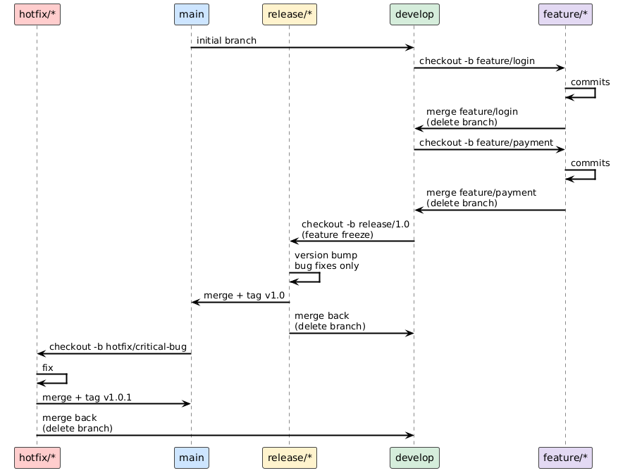
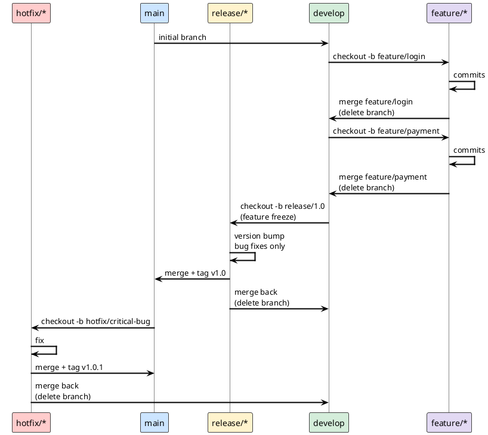
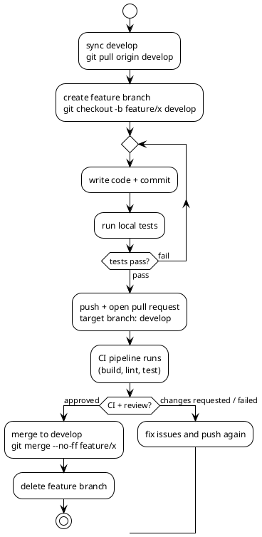
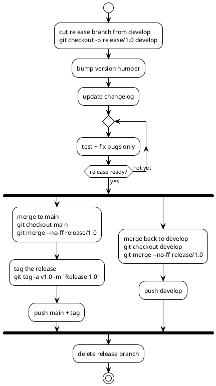
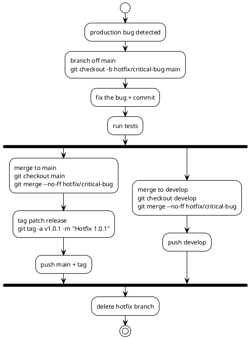

# GitFlow Workflow

## TOC

- [introduction](#introduction)
- [branch types](#branch-types)
- [branching model](#branching-model)
- [feature branch workflow](#feature-branch-workflow)
- [release branch workflow](#release-branch-workflow)
- [hotfix workflow](#hotfix-workflow)
- [when to use gitflow](#when-to-use-gitflow)
- [references](#references)

## Introduction

GitFlow is a branching model designed for projects with scheduled, versioned releases. It was introduced by Vincent Driessen in 2010. It defines a strict branching structure with dedicated branches for features, releases, and hotfixes.

GitFlow is well-suited for software that ships discrete versions (libraries, desktop apps, mobile apps). It is generally **not recommended** for web services with continuous deployment — for those, prefer [trunk-based development](git-workflow-trunk-based.md).

## Branch Types

| Branch | Lifetime | Branched from | Merged into | Purpose |
|--------|----------|---------------|-------------|---------|
| `main` | permanent | — | — | Production-ready code; every commit is a release |
| `develop` | permanent | `main` | — | Integration branch; latest delivered development |
| `feature/*` | temporary | `develop` | `develop` | New features |
| `release/*` | temporary | `develop` | `main` + `develop` | Release preparation; only bug fixes allowed |
| `hotfix/*` | temporary | `main` | `main` + `develop` | Urgent production fixes |

Rules:
- `main` is always tagged with a version number at each merge
- No direct commits to `main` or `develop`
- `feature` branches never interact with `main`
- Both `release` and `hotfix` branches must be merged back to **both** `main` and `develop`

## Branching Model

The following diagram shows the full lifecycle of all branch types across time.






## Feature Branch Workflow

Each new feature lives in its own branch, branched off `develop` and merged back when complete.



```bash
git checkout develop
git pull origin develop
git checkout -b feature/my-feature

# ... work, commit ...

git push origin feature/my-feature
# open pull request → develop

# after merge:
git branch -d feature/my-feature
git push origin --delete feature/my-feature
```

> Use `--no-ff` (no fast-forward) when merging features to preserve branch history in the graph.

## Release Branch Workflow

When `develop` has enough features for a release, a `release` branch is cut. Only bug fixes and release preparation (version bumps, changelog) are allowed — no new features.



```bash
git checkout develop
git checkout -b release/1.0

# bump version, update CHANGELOG, fix bugs only

git checkout main
git merge --no-ff release/1.0
git tag -a v1.0 -m "Release 1.0"

git checkout develop
git merge --no-ff release/1.0

git branch -d release/1.0
```

## Hotfix Workflow

Hotfixes address critical production bugs that cannot wait for the next planned release. They branch from `main` (not `develop`) and must be merged back to **both** `main` and `develop`.



```bash
git checkout main
git checkout -b hotfix/critical-bug

# fix the bug

git checkout main
git merge --no-ff hotfix/critical-bug
git tag -a v1.0.1 -m "Hotfix 1.0.1"

git checkout develop
git merge --no-ff hotfix/critical-bug

git branch -d hotfix/critical-bug
```

> If a `release` branch currently exists, merge the hotfix into that instead of `develop` — it will flow into `develop` when the release is completed.

## When to Use GitFlow

**Use GitFlow when:**
- The project ships discrete, versioned releases (v1.0, v1.1, v2.0)
- Multiple versions must be maintained in parallel (v1.x and v2.x)
- A regulated or audited release process is required
- The team ships infrequently (monthly, quarterly)

**Do NOT use GitFlow when:**
- The project deploys continuously to production
- The team merges to main multiple times per day
- You want simple CI/CD — the multi-branch model makes pipelines complex

See [git-workflow-trunk-based.md](git-workflow-trunk-based.md) for the alternative.

## References

- [A successful Git branching model — Vincent Driessen (2010)](https://nvie.com/posts/a-successful-git-branching-model/)
- [Atlassian: Gitflow workflow](https://www.atlassian.com/git/tutorials/comparing-workflows/gitflow-workflow)
- [git-flow CLI tool](https://github.com/nvie/gitflow)
- [Vincent Driessen's note (2020): consider trunk-based for web projects](https://nvie.com/posts/a-successful-git-branching-model/#a-note-of-reflection)
