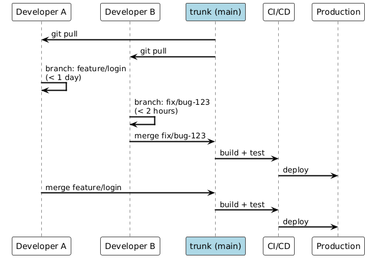
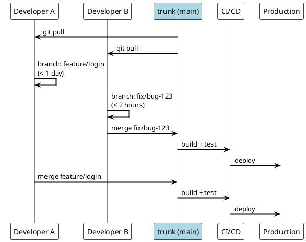
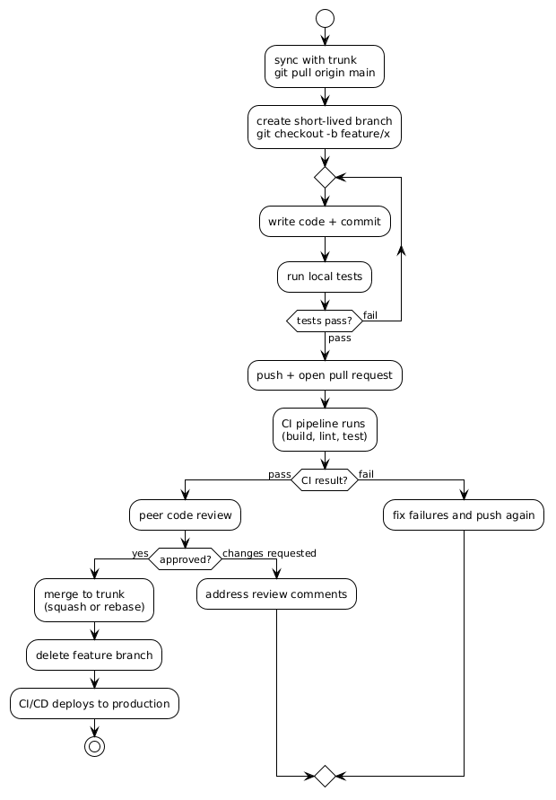
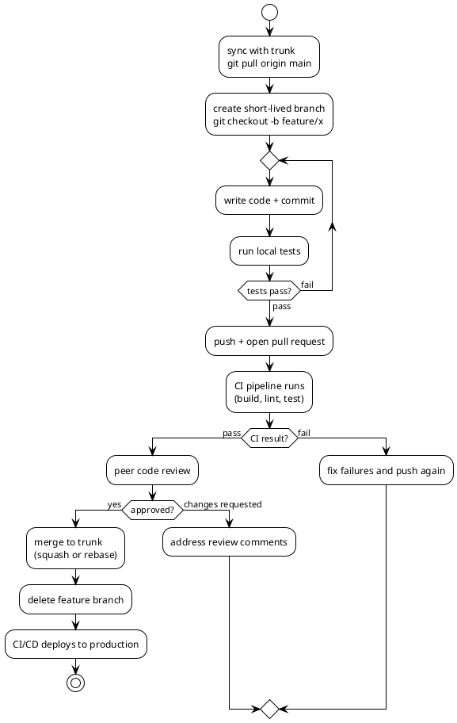

# Trunk-Based Development Workflow

## TOC

- [introduction](#introduction)
- [core principles](#core-principles)
- [branching model](#branching-model)
- [developer workflow](#developer-workflow)
- [feature flags](#feature-flags)
- [comparison with gitflow](#comparison-with-gitflow)
- [branch naming](#branch-naming)
- [references](#references)

## Introduction

Trunk-based development (TBD) is a branching model where all developers integrate into a single shared branch — the "trunk" (`main` or `master`). Feature branches are short-lived (hours to at most 2 days) and merged back to trunk frequently.

It is the foundation for true Continuous Integration: if developers are not merging to trunk daily, they are not doing CI.

Key insight: long-lived branches are the root cause of merge conflicts, integration pain, and slow delivery. TBD eliminates them.

## Core Principles

- **Single trunk**: `main` is the only long-lived branch
- **Short-lived branches**: feature branches live hours to 2 days maximum
- **Always releasable**: trunk must pass all tests and be deployable at any point in time
- **Feature flags**: hide incomplete work behind flags instead of using long-lived branches
- **Automated CI/CD**: build, test, and deploy on every merge to trunk

## Branching Model

The following diagram shows two developers working in parallel on trunk-based development. Both branches are short-lived and merge to trunk independently, triggering CI/CD each time.





## Developer Workflow





## Feature Flags

For work that takes longer than 1–2 days, use feature flags to hide incomplete code on trunk rather than keeping a long-lived branch:

```python
if feature_flag("new-checkout-flow"):
    show_new_checkout()
else:
    show_old_checkout()
```

This allows merging to trunk continuously without exposing unfinished features to users. The flag is removed once the feature is complete and validated in production.

Tooling: LaunchDarkly, Unleash, Flipt, or simple environment-variable flags.

## Comparison with GitFlow

| | Trunk-based | GitFlow |
|---|---|---|
| Long-lived branches | trunk only | main, develop, release, hotfix |
| Feature branch lifetime | hours to 2 days | weeks to months |
| Integration frequency | daily or multiple times/day | per feature completion |
| Merge conflict risk | low | high |
| CI/CD compatibility | excellent | poor |
| Release process | continuous from trunk | via release branches |
| Feature isolation | feature flags | long-lived branches |
| Complexity | low | high |
| Best for | web services, continuous delivery | versioned software, infrequent releases |

## Branch Naming

```bash
feature/short-description   # new feature (max 2 days)
fix/bug-description         # bug fix
chore/task-description      # maintenance, dependency update
```

## References

- [trunkbaseddevelopment.com](https://trunkbaseddevelopment.com/)
- [DORA: State of DevOps report](https://dora.dev/research/)
- [Atlassian: trunk-based development](https://www.atlassian.com/continuous-delivery/continuous-integration/trunk-based-development)
- [Martin Fowler: feature flags](https://martinfowler.com/articles/feature-toggles.html)
- [Martin Fowler: trunk-based development](https://martinfowler.com/bliki/TrunkBasedDevelopment.html)
